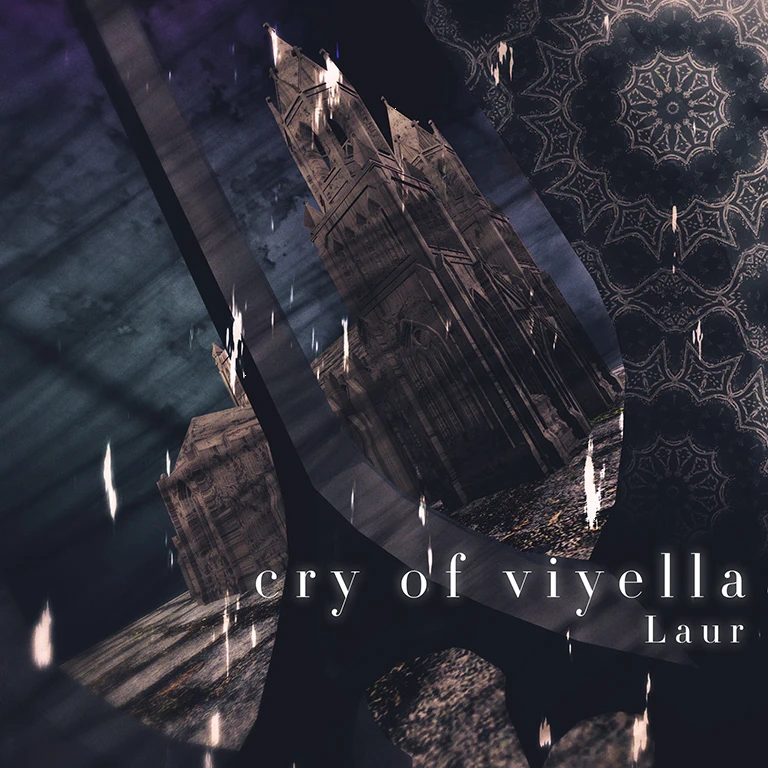

# cry of viyella

___

| | |
| --- | --- |
| Song Jacket |  |
| Composer | Laur |
| Artwork | Khronetic |
| Vocals | Vocal Samples, Choral |
| BPM | 75-180 |
| Side | Conflict |
| Length | 75-180 |
| Background | base_conflict |
| Genre | Hardcore / Barock[^1] |
| Added | Version 1.0.8 (2017-03-09) |

## Chart Information

| Difficulty: | Past | Present | Future |
| --- | --- | --- | --- |
| Level | 3 | 6 | 8+ |
| Notes | 414 | 492 | 791 |
| Chart Constant | 3.5 | 6.0 | 8.7 |
| Charter | Toaster | Toaster | Toaster |
| [Unit Score](../game/scoring.md#unit-score) | 12,077.2 | 10,162.6 | 6,321.1 |

## Unlock Requirements

| | |
| --- | --- |
| Pack | Eternal Core |
| World Mode | |
| Past | |
| Present |  |
| Future |  |

## Official Sound

<iframe width="100%" height="300" scrolling="no" frameborder="no" allow="autoplay" src="https://w.soundcloud.com/player/?url=https%3A//api.soundcloud.com/tracks/187948462&color=%23ff5500&auto_play=false&hide_related=false&show_comments=true&show_user=true&show_reposts=false&show_teaser=true&visual=true"></iframe>
<a href="https://soundcloud.com/laur_10" title="Laur" target="_blank" style="color: #cccccc; text-decoration: none;">Laur</a> · <a href="https://soundcloud.com/laur_10/laur-cry-of-viyella-sf-2015" title="Laur - cry of viyella" target="_blank" style="color: #cccccc; text-decoration: none;">Laur - cry of viyella</a>

| | Release Information |
|---|---|
| Release | Shooter's Festival 2015, *TANO\*C Short Collection* |

## Trivia

- cry of viyella was made for the Shooter's Festival 2015 K-Shoot MANIA contest.[^2],[^3] With a score of 9505, it placed 8th overall.
  - This is currently the only song originally made for a K-Shoot Mania contest.
  - It was made as a remake of Laur's older song "Lonely Girl".[2]
- The song's jacket art was changed in v2.2.0.
  - Prior to this, the song's jacket art was produced by Ya-k.

    
- cry of viyella is part of Laur's Viyella song series, which includes Viyella's Tears.

___

## Citations
