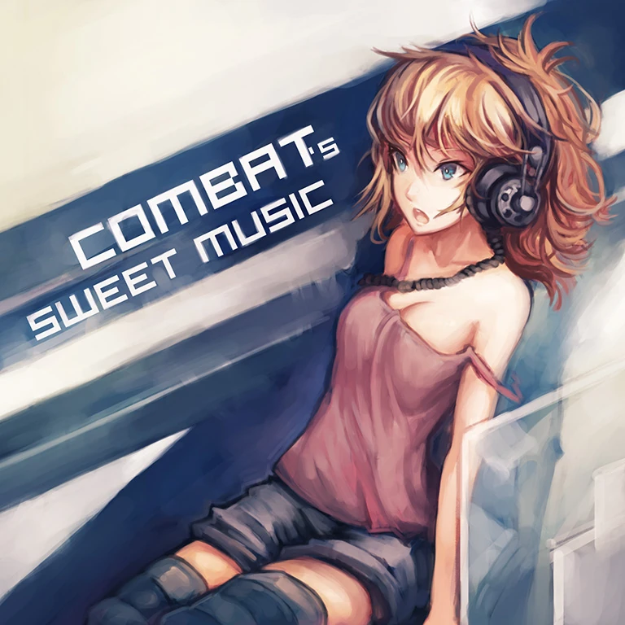

# Rise

___

| | |
| --- | --- |
| Song Jacket |  |
| Composer | Combatplayer |
| Artwork | Doomfest[^1] (not credited) |
| Vocals | |
| BPM | 140 |
| Side | Light |
| Length | 2:21 |
| Background | base_light |
| Genre | Chiptune[^2] |
| Added | Version 1.0.5 (2017-03-08) |

## Chart Information

| Difficulty: | Past | Present | Future |
| --- | --- | --- | --- |
| Level | 2 | 4 | 7+ |
| Notes | 322 | 599 | 788 |
| Chart Constant | 2.5 | 4.0 | 7.8 |
| Charter | Nitro | Nitro | Nitro |
| [Unit Score](../game/scoring.md#unit-score) | 15,527.9 | 8,347.2 | 6,345.1 |

## Unlock Requirements

| | |
| --- | --- |
| Pack | Arcaea |
| World Mode | |
| Past | |
| Present | 20 Fragments |
| Future | 160 Fragments |

## Official Sound

<iframe width="560" height="315" src="https://www.youtube.com/embed/Xf0rRZKdBrU?si=VLJ15XlknLI7-OZW" title="YouTube video player" frameborder="0" allow="accelerometer; autoplay; clipboard-write; encrypted-media; gyroscope; picture-in-picture; web-share" referrerpolicy="strict-origin-when-cross-origin" allowfullscreen></iframe>

<iframe width="100%" height="300" scrolling="no" frameborder="no" allow="autoplay" src="https://w.soundcloud.com/player/?url=https%3A//api.soundcloud.com/tracks/219649014&color=%23ff5500&auto_play=false&hide_related=false&show_comments=true&show_user=true&show_reposts=false&show_teaser=true&visual=true"></iframe>
<a href="https://soundcloud.com/combatplayer" title="CombatPlayer" target="_blank" style="color: #cccccc; text-decoration: none;">CombatPlayer</a> · <a href="https://soundcloud.com/combatplayer/rise" title="Rise" target="_blank" style="color: #cccccc; text-decoration: none;">Rise</a>

| | Release Information |
|---|---|
| Release | *Combat's Sweet Music* |
| Links | [Bandcamp](https://combatplayer.bandcamp.com/track/rise) |

## Trivia

___

## Citations

[^1]: [Redirects to Bandcamp](https://combatplayer.bandcamp.com/album/combats-sweet-music). Alias of softmode.
[^2]: [Redirects to Soundcloud](https://soundcloud.com/combatplayer/rise)
