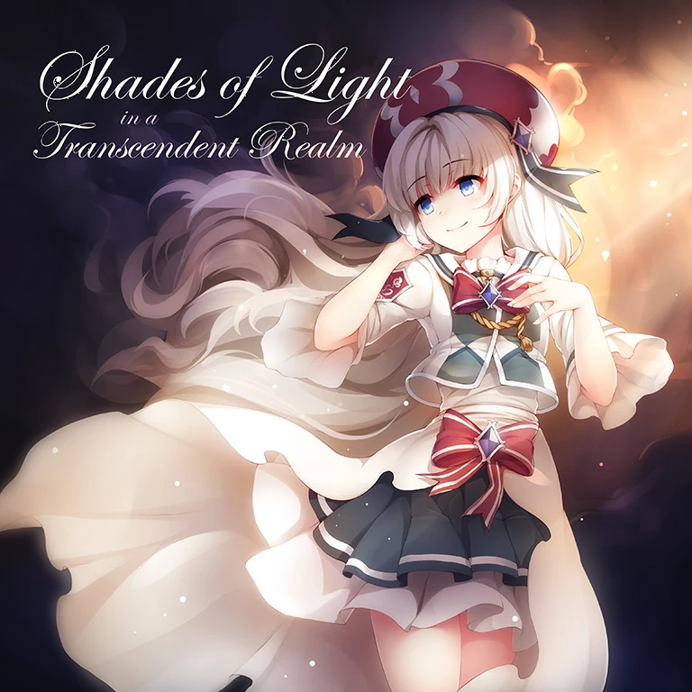
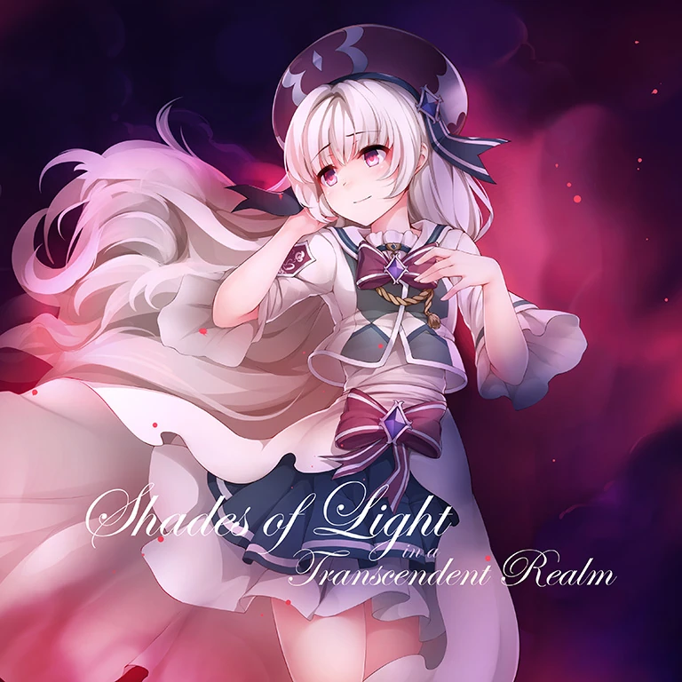

# Shades of Light in a Transcendent Realm

___

| | Default | Beyond |
|---|---|---|
| Song Jacket |  |  |
| Composer | ak+q | ak+q |
| Artwork | RiceGnat | RiceGnat |
| Vocals | | |
| BPM | 170 | 170 |
| Side | Light | Light |
| Length | 2:30 | 2:30 |
| Background | base_light | base_light |
| Genre | High DnB / Glitch [^1] | High DnB / Glitch |
| Added | Version 1.0.5 (2017-Mar-08) | Version 4.3.2 (2023-Mar-09) |

## Chart Information

| Difficulty: | Past | Present | Future | Beyond |
| --- | --- | --- | --- | --- |
| Level | 3 | 6 | 8 | 9 |
| Notes | 517 | 789 | 1067 | 1042 |
| Chart Constant | 3.0 | 6.0 | 8.3 | 9.0 |
| Charter | Nitro | Nitro | Nitro | N↑TRO |
| [Unit Score](../game/scoring.md#unit-score) | 9,671.1 | 6,337.1 | | |

## Unlock Requirements

| | |
| --- | --- |
| Pack | |
| World Mode | |
| Past | |
| Present | 60 Fragments |
| Future | 200 Fragments |
| Beyond | L-29 Shades of Light in a Transcendent Realm |

## Official Sound

<iframe width="100%" height="300" scrolling="no" frameborder="no" allow="autoplay" src="https://w.soundcloud.com/player/?url=https%3A//api.soundcloud.com/tracks/273739966&color=%23ff5500&auto_play=false&hide_related=false&show_comments=true&show_user=true&show_reposts=false&show_teaser=true&visual=true"></iframe>
<a href="https://soundcloud.com/ak_q" title="ak+q" target="_blank" style="color: #cccccc; text-decoration: none;">ak+q</a> · <a href="https://soundcloud.com/ak_q/shades-of-light-in-a-transcendent-realm" title="Shades of Light in a Transcendent Realm" target="_blank" style="color: #cccccc; text-decoration: none;">Shades of Light in a Transcendent Realm</a>

| | Release Information |
|---|---|
| Release | Arcaea, *ak+q selected works 2015 - 2019* |
| Links | [Bandcamp](https://ak-q.bandcamp.com/track/shades-of-light-in-a-transcendent-realm) |

## Trivia

- This song was originally created by ak+q in 2016, and was remastered and cut for use in Arcaea
- ak+q uploaded a [YouTube video](https://www.youtube.com/watch?v=nP70bnzpYDY) describing a part of his song creation process
- This song's World Mode requirement was removed in v5.4.0, since it became required for the Arcaea story.
- This song held the record for having the most characters in a song title (39 characters) until it was beaten by `LunarOrbit -believe in the Espebranch road-` (43), `Misdeed -la bonté de Dieu et l'origine du mal-` (46), and `Hiiro Gekka, Kyoushou no Zetsu (nayuta 2017 ver.)` (49).
- This song's BYD chart contains notes and arcs that are above the Sky Input line, similar to the Beyond chart of Party Vinyl.
  - Some of these notes and arcs may be too high for players with wide screen ratios to view properly, similar to certain sections of the April Fools chart of Singularity VVVIP.
- The font used in the jacket is 'Edwardian Script Alt'.
  - This font is also used in Silent Rush.

___

## Citations

[^1]: [Redirects to Soundcloud](https://soundcloud.com/ak_q/shades-of-light-in-a-transcendent-realm)
